# ATELIER — From Image to Cluster

## Présentation du projet

Cet atelier DevOps a pour objectif d’**industrialiser le cycle de vie d’une application simple** en appliquant les principes de **l’Infrastructure as Code (IaC)**.

Le workflow couvre l’ensemble de la chaîne :
- Création d’une **image Docker Nginx customisée** avec **Packer**
- Déploiement automatisé sur un **cluster Kubernetes K3d**
- Orchestration via **Ansible**
- Automatisation complète grâce à un **Makefile**

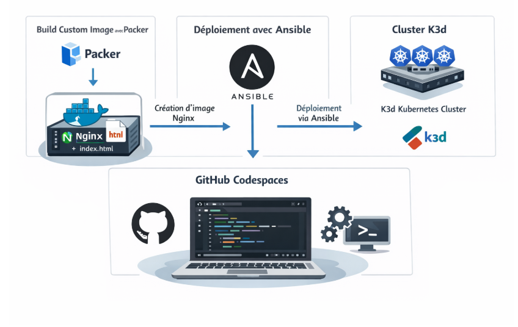

Résultat final :  
Une **application web Nginx personnalisée (avec une licorne 🦄)**, déployée automatiquement sur Kubernetes.

---

## Stack technique

- **Docker**
- **Packer**
- **Ansible**
- **Kubernetes (K3d)**
- **kubectl**
- **Makefile**
- **GitHub Codespaces**

---

## Étape 1 — Création de l’environnement (Codespace)

1. Forker le repository GitHub
2. Onglet **Code → Create Codespace**
3. Attendre l’initialisation de l’environnement

---

## Étape 2 — Installation et création du cluster K3d

### Installation de K3d
```bash
curl -s https://raw.githubusercontent.com/k3d-io/k3d/main/install.sh | bash
```

## Création du cluster Kubernetes
```bash
k3d cluster create lab --servers 1 --agents 2
```

## Vérification
```bash
kubectl get nodes
```

## Déploiement d’une application de test (Docker Mario)
```bash
kubectl create deployment mario --image=sevenajay/mario
kubectl expose deployment mario --type=NodePort --port=80
kubectl get svc
```

## Port-forward
```bash
kubectl port-forward svc/mario 8080:80 >/tmp/mario.log 2>&1 &
```

L’application est accessible via le port exposé dans l’onglet PORTS de Codespaces.

Les ports visible sur VSC :
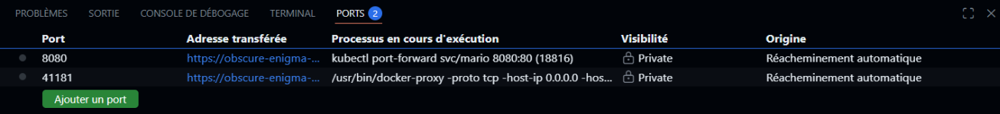

https://obscure-enigma-qgjv45754jph4qq9-41181.app.github.dev/

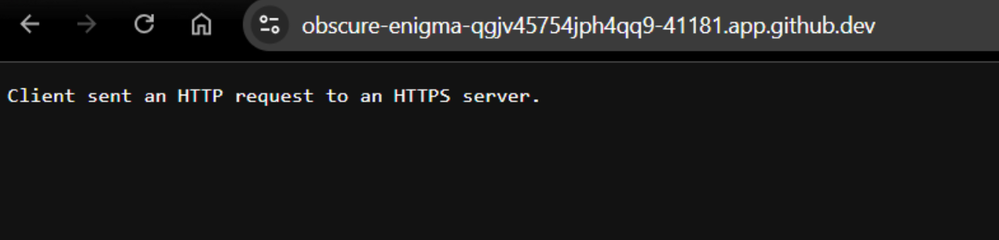

https://obscure-enigma-qgjv45754jph4qq9-8080.app.github.dev/
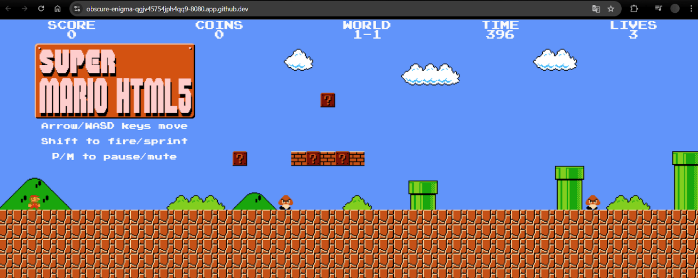

# Étape 3 — Installation des outils nécessaires

## Installation d’Ansible

```bash
sudo apt update
sudo apt install -y ansible
ansible --version
```
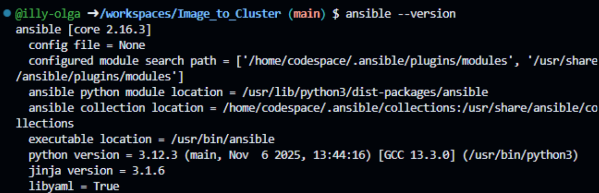

## Installation de Packer (HashiCorp)

Ajouter la clé GPG :
```bash
curl -fsSL https://apt.releases.hashicorp.com/gpg | \
sudo gpg --dearmor -o /usr/share/keyrings/hashicorp-archive-keyring.gpg
```
Ajouter le dépôt :
```bash
echo "deb [signed-by=/usr/share/keyrings/hashicorp-archive-keyring.gpg] \
https://apt.releases.hashicorp.com $(lsb_release -cs) main" | \
sudo tee /etc/apt/sources.list.d/hashicorp.list
```


Installation :
```bash
sudo apt update
sudo apt install -y packer
packer version
```
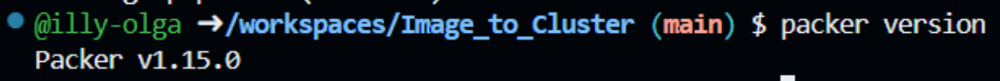

Vérification Docker :
```bash
docker version
```
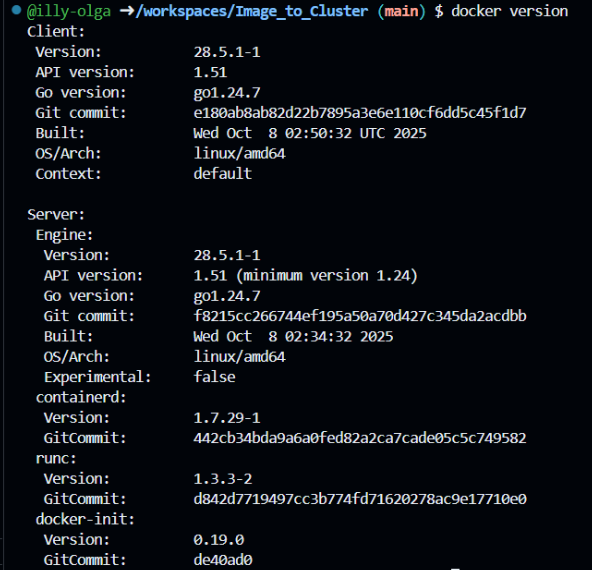

# Étape 4 — Création du contenu applicatif

Création d’une page web personnalisée index.html :

```bash 
nano index.html
```

```html
<!DOCTYPE html>
<html lang="fr">
<head>
  <meta charset="UTF-8">
  <title>From Image to Cluster</title>
  <style>
    body {
      font-family: Arial, sans-serif;
      background: linear-gradient(135deg, #667eea, #764ba2);
      color: white;
      text-align: center;
      padding-top: 100px;
    }
    .card {
      background: rgba(0, 0, 0, 0.3);
      padding: 40px;
      border-radius: 20px;
      display: inline-block;
    }
    h1 {
      font-size: 3em;
    }
    .unicorn {
      font-size: 5em;
    }
  </style>
</head>
<body>
  <div class="card">
    <div class="unicorn">🦄</div>
    <h1>From Image to Cluster</h1>
    <p>Image Docker customisée avec Packer</p>
    <p>Déployée automatiquement sur Kubernetes (K3d)</p>
  </div>
</body>
</html>
```


# Étape 5 — Build de l’image Docker avec Packer
Fichier nginx.pkr.hcl

```bash 
nano nginx.pkr.hcl
```

```hcl 
packer {
  required_plugins {
    docker = {
      version = ">= 1.0.8"
      source  = "github.com/hashicorp/docker"
    }
  }
}

source "docker" "nginx" {
  image  = "nginx:latest"
  commit = true
}

build {
  sources = ["source.docker.nginx"]

  provisioner "shell" {
    inline = ["rm /usr/share/nginx/html/index.html"]
  }

  provisioner "file" {
    source      = "index.html"
    destination = "/usr/share/nginx/html/index.html"
  }

  provisioner "shell" {
    inline = ["chmod 644 /usr/share/nginx/html/index.html"]
  }

  post-processor "docker-tag" {
    repository = "nginx-custom"
    tags       = ["latest"]
  }
}
```

Build de l’image

```bash
packer init .
packer build .
```
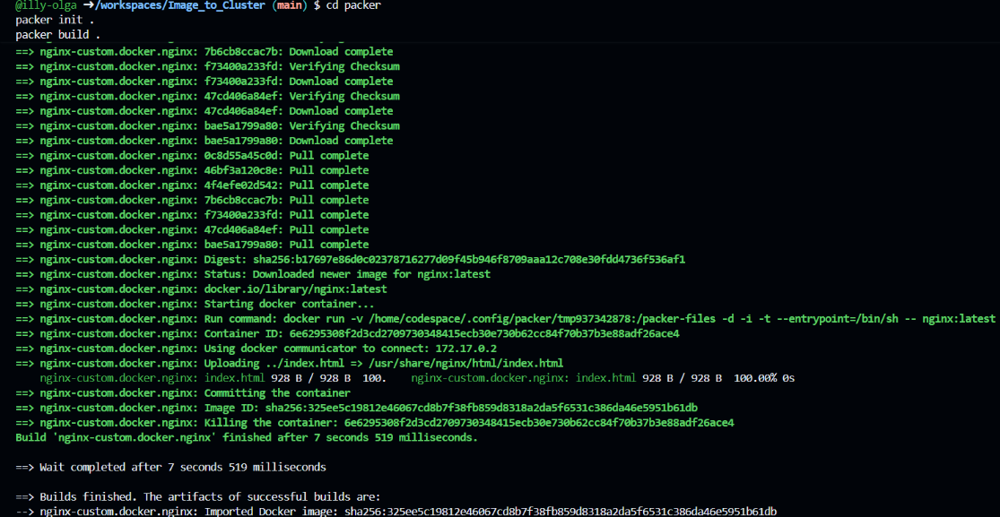

Vérification
```bash
docker images | grep nginx-custom
```


# Étape 6 — Import de l’image dans le cluster K3d
```bash
k3d image import nginx-custom:latest -c lab
```
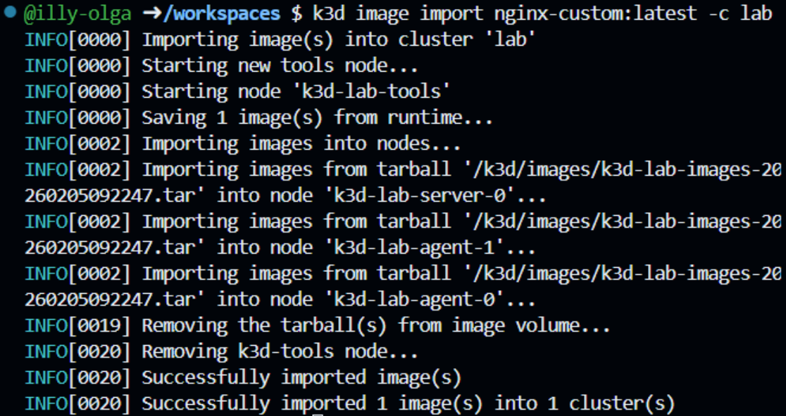

# Étape 7 — Déploiement Kubernetes via Ansible

```bash 
nano deploy.yml
```

Fichier deploy.yml
```yml
- name: Deploy Nginx on K3d
  hosts: localhost
  gather_facts: false
  tasks:

    - name: Build Docker image with Packer
      shell: |
        packer init nginx.pkr.hcl
        packer build nginx.pkr.hcl

    - name: Import image into K3d cluster
      shell: k3d image import nginx-custom:latest -c lab

    - name: Deploy Nginx Deployment
      shell: |
        kubectl apply -f - <<EOF
        apiVersion: apps/v1
        kind: Deployment
        metadata:
          name: nginx
        spec:
          replicas: 1
          selector:
            matchLabels:
              app: nginx
          template:
            metadata:
              labels:
                app: nginx
            spec:
              containers:
                - name: nginx
                  image: nginx-custom:latest
                  imagePullPolicy: IfNotPresent
                  ports:
                    - containerPort: 80
        EOF

    - name: Deploy Nginx Service
      shell: |
        kubectl apply -f - <<EOF
        apiVersion: v1
        kind: Service
        metadata:
          name: nginx
        spec:
          type: NodePort
          selector:
            app: nginx
          ports:
            - port: 80
              targetPort: 80
              nodePort: 30081
        EOF

    - name: Force rollout
      shell: kubectl rollout restart deployment nginx

```

Lancement
```bash 
ansible-playbook deploy.yml
```

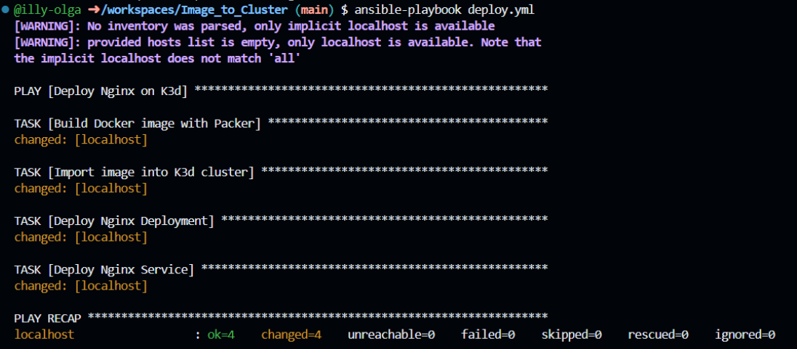

# Étape 8 — Automatisation avec Makefile

Contenu du Makefile

Le Makefile permet de :
* automatiser le build de l’image Docker avec Packer
* lancer le déploiement Kubernetes avec Ansible
* exposer l’application
* nettoyer le cluster

```bash 
nano Makefile
```

```makefile
.PHONY: all build deploy port-forward clean

all: build deploy

build:
	packer init nginx.pkr.hcl
	packer build nginx.pkr.hcl

deploy:
	ansible-playbook deploy.yml

port-forward:
	@echo "Application accessible sur le port 8081"
	kubectl port-forward svc/nginx 8081:80

clean:
	kubectl delete deployment nginx || true
	kubectl delete service nginx || true
	k3d image delete nginx-custom:latest || true

```

# Étape 9 — Vérifications finales
```bash
kubectl get pods
```
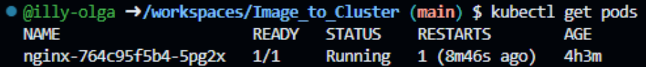
```bash
kubectl get svc
```
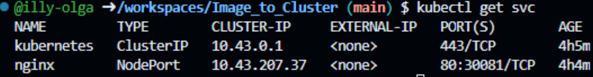


### Résultat attendu

Pod nginx → Running

Service NodePort → 30081

Application web accessible avec la licorne 🦄

## Lancer le projet
```bash
make all
```
Accès à l’application :

```bash
make port-forward
```
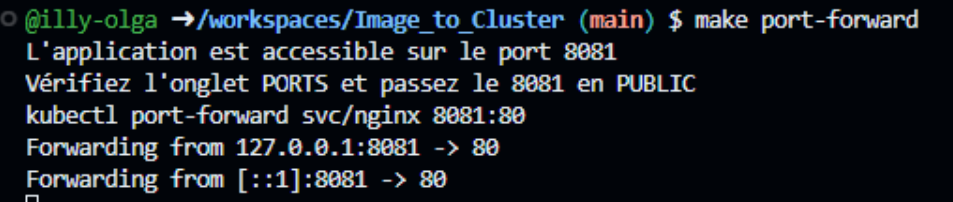

* Rendre le port 8081 public via l’onglet PORTS
* Ouvrir l’URL → 🦄

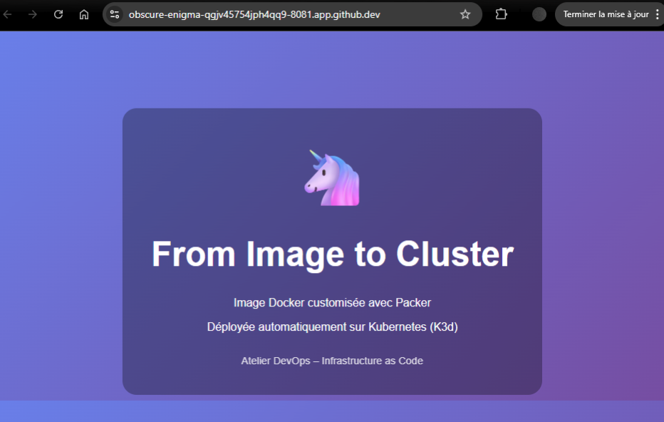

